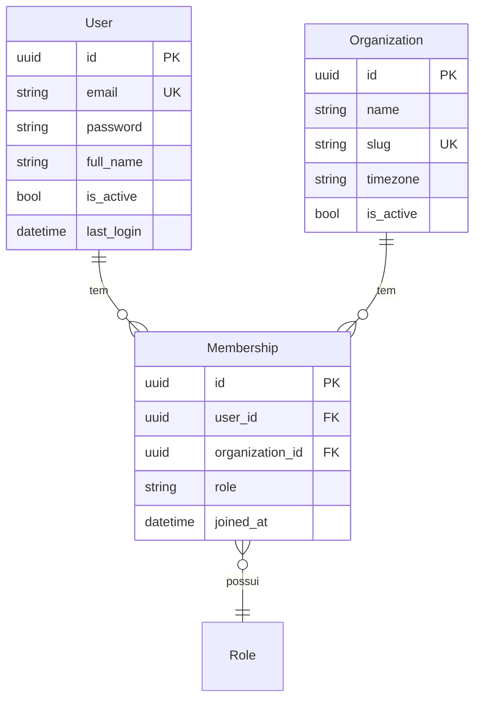
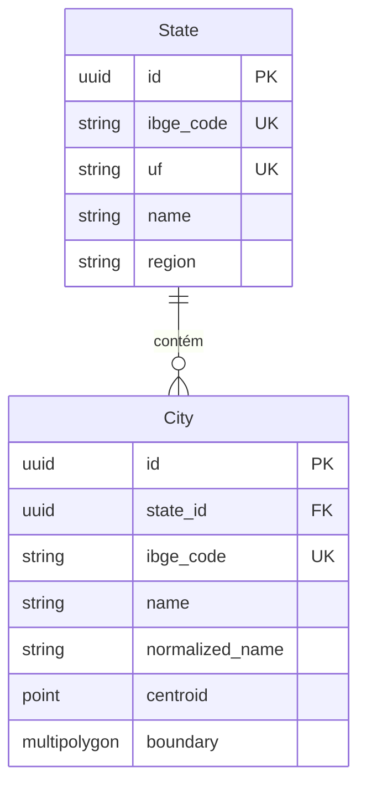
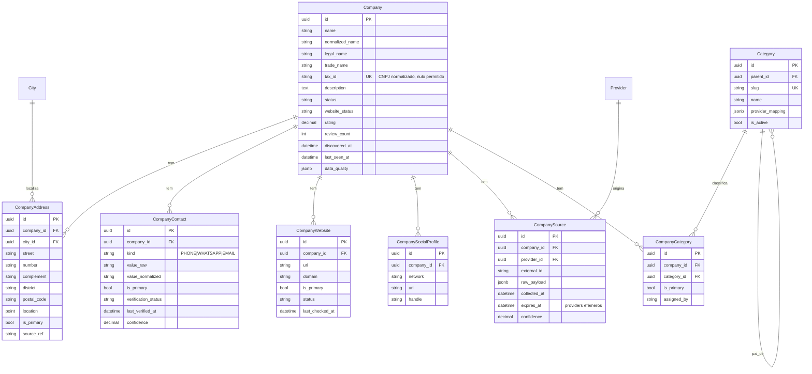
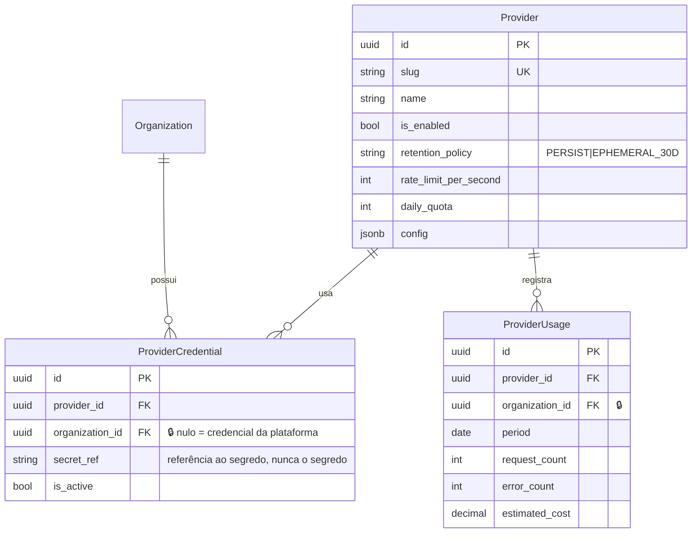
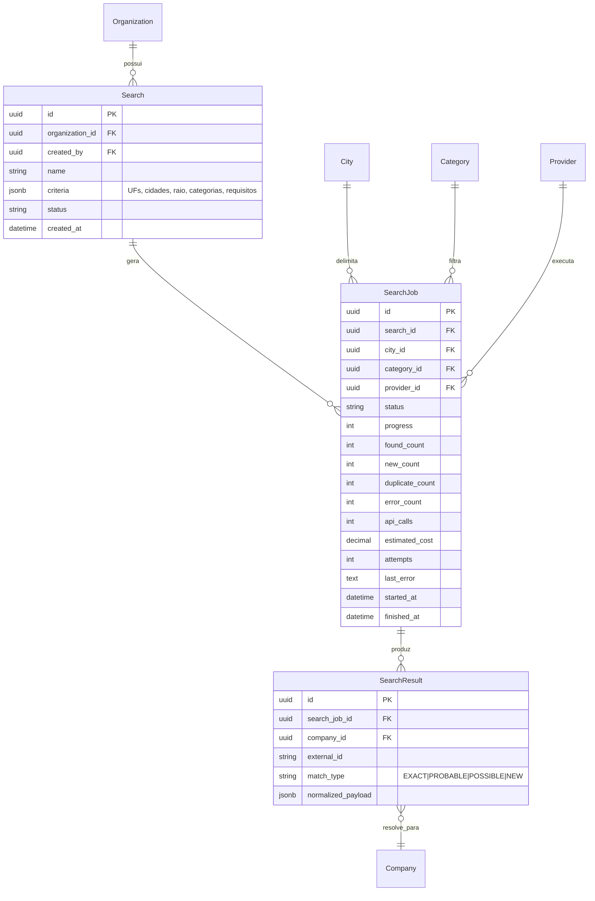
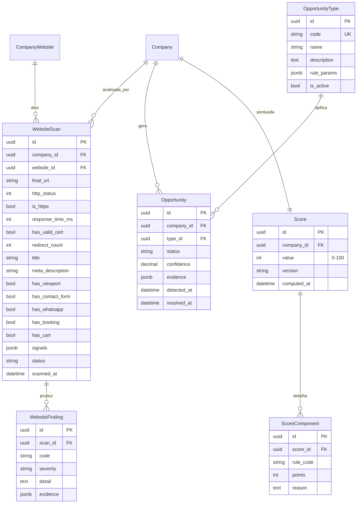
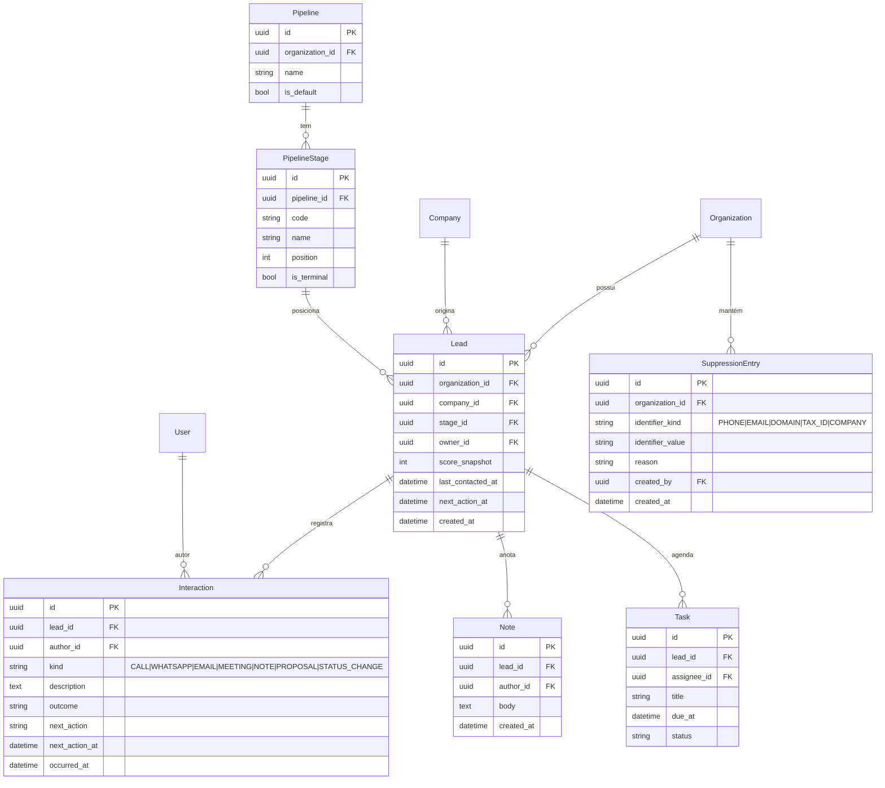
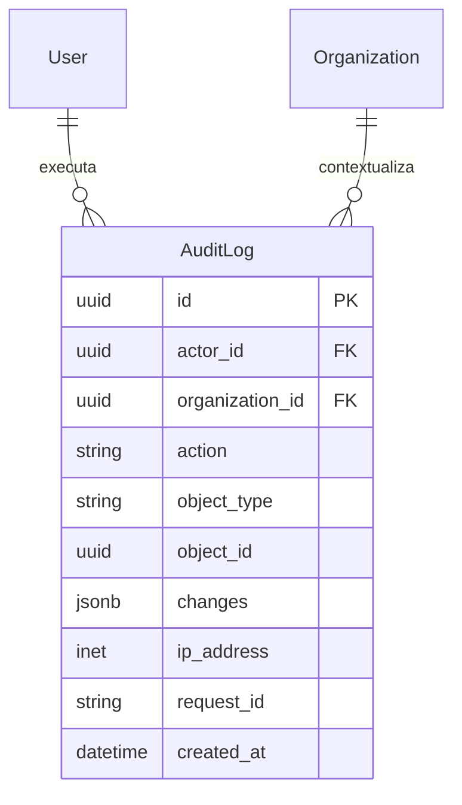

# ERD — modelo de dados

Marcação de escopo em cada tabela:

- 🌐 **global** — dado público sobre a empresa no mundo real, compartilhado entre organizações.
- 🔒 **tenant** — dado comercial, pertence a uma `Organization` e nunca cruza a fronteira.

Ver [ADR-0007](adr/0007-tenancy-boundary.md) para o porquê.

## Contas e tenancy

`UniqueConstraint(user, organization)` em `Membership`. Papéis: `OWNER`, `ADMIN`, `MANAGER`,
`SALES`, `VIEWER`.

## Geografia 🌐

Códigos IBGE são a chave natural. `centroid` alimenta o particionamento geográfico das buscas;
`boundary` é opcional e entra quando houver necessidade real de contorno.

## Empresas 🌐

> **Onde cada tabela mora.** `CompanySource` está no diagrama de Empresas porque é dela que
> a procedência fala, mas o app que a hospeda é `providers` (Etapa 7): ela tem FK para
> `Provider`, e a ordem de dependência do `CLAUDE.md` é `companies` ← `providers` — companies
> não pode depender de providers. O relacionamento acima continua válido; muda só o pacote.

Pontos que valem constraint no banco:

- `UniqueConstraint(provider, external_id)` em `CompanySource` — base da idempotência.
- `UniqueConstraint(tax_id)` parcial (só quando não nulo) em `Company`.
- `UniqueConstraint(company, kind, value_normalized)` em `CompanyContact`.
- Índice GIN `pg_trgm` em `Company.normalized_name` e índice composto com a cidade — é o que
  torna a deduplicação viável em milhões de linhas.
- Índice GiST em `CompanyAddress.location` (PostGIS).

`Category.provider_mapping` guarda a tradução da categoria interna para cada fonte
(ex.: OSM `amenity=dentist`, CNAE `8630-5/04`) — é isso que evita categoria hardcoded no código.

## Providers

`retention_policy` é o que faz a diferença entre um provider cujos dados podem virar registro
permanente e um que só pode manter identificador + cache com expiração ([ADR-0004](adr/0004-osm-primary-provider.md)).

## Descoberta 🔒

Status de `SearchJob`: `pending`, `scheduled`, `running`, `partially_completed`, `completed`,
`failed`, `cancelled`.

## Análise, oportunidades e score 🌐

`ScoreComponent` é o breakdown auditável exigido: cada ponto do score tem regra e justificativa.
`OpportunityType.rule_params` parametriza um predicado registrado em código
([ADR-0008](adr/0008-declarative-rules.md)) — o banco não guarda expressão para interpretar.

`SegmentSolution` (recomendação de sistemas por segmento — dentista → agendamento, restaurante →
cardápio digital) entra na Etapa 10 como tabela ligando `Category` a `OpportunityType` com
peso, mantendo essas regras fora do código.

## CRM 🔒

`UniqueConstraint(organization, company)` em `Lead` — uma empresa é um lead por organização.
`UniqueConstraint(organization, identifier_kind, identifier_value)` em `SuppressionEntry`, com
índice usado pelo pipeline de ingestão.

`Interaction` é append-only: mudança de estágio vira registro `STATUS_CHANGE`, nunca sobrescreve.

## Auditoria 🌐

Append-only: a aplicação não faz update nem delete.
